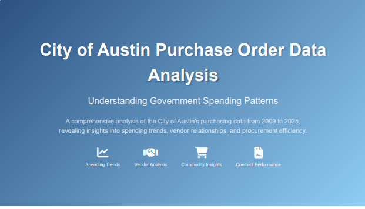

# Excel Analysis Project: City of Austin Purchase Order Data

##

## Project Overview
This project focuses on analyzing the City of Austin's purchase order commodity line-level dataset using Microsoft Excel. The primary goal is to uncover significant patterns in spending, identify key vendors, and extract time-based trends to provide actionable insights into the city's procurement activities.

## Table of Contents

- [Project Overview](#project-overview)
- [Features & Analysis Objectives](#features--analysis-objectives)
- [Dataset](#dataset)
- [Data Preparation](#data-preparation)
- [Key Insights](#key-insights)
- [Tools & Technologies](#tools--technologies)
- [How to Use/Reproduce](#how-to-usereproduce)
- [Contact](#contact)

## Features & Analysis Objectives

This project demonstrates various data analysis techniques within Excel, focusing on:

1.  **Total Spend Over Time**: Visualizing the overall spending patterns across different years to identify trends and anomalies.
   

2.  **Top Vendors by Spend**: Identifying the primary vendors by total expenditure, crucial for vendor management and negotiation strategies.
   

3.  **Most Frequently Purchased Commodities**: Pinpointing the most commonly acquired goods or services, offering insights into operational needs.
  

4.  **Spending Trend by Month/Year**: Analyzing spending fluctuations on a monthly and yearly basis to understand seasonality and long-term trends.
  

5.  **Average Spend Per Commodity**: Calculating the average expenditure for specific commodities, useful for budgeting and cost control.
 

6.  **Spend by Contract or Master Agreement**: Examining expenditure linked to specific contracts or master agreements to assess compliance and utilization.

### Visualizations & Interactivity

The project emphasizes the use of Excel's built-in visualization tools to enhance data understanding:

-   **PivotCharts**: For dynamic and interactive graphical representations of the data.
-   **Slicers**: To enable interactive filtering of data by `Year`, `Vendor`, `Commodity`, or any other relevant field, making the analysis more user-friendly and exploratory.

## [Dataset](https://data.austintexas.gov/Budget-and-Finance/Purchase-Order-Quantity-Price-detail-for-Commodity/3ebq-e9iz/data_preview)

The analysis is based on the City of Austin's purchase order commodity line-level dataset. This dataset captures detailed information about commodity and goods purchases made by the City of Austin, with records dating from October 1, 2009, onwards. Each row in the dataset represents a single transaction line item and includes comprehensive details pertinent to procurement analysis.

### Data Fields

The dataset comprises the following key columns:

-   **NIGP Commodity Code / COA Inventory Code**: Standardized codes for classifying commodities.
-   **Commodity Description**: A textual description of the purchased item.
-   **Quantity**: The number of units purchased in a given transaction.
-   **Unit of Measure**: The unit by which the quantity is measured (e.g., 'EA' for each, 'LB' for pound).
-   **Unit Price**: The cost per unit of the commodity.
-   **Total Amount**: The total expenditure for that line item (Quantity * Unit Price).
-   **Referenced Master Agreement (if applicable)**: Indicates if the purchase was made under a pre-existing master agreement.
-   **Contract Name**: The name of the contract associated with the purchase.
-   **Purchase Order Number**: Unique identifier for the purchase order.
-   **Award Date**: The date when the purchase order was awarded.
-   **Vendor Information**: Details about the vendor supplying the commodity.

### Exclusions

It is important to note that some Austin Energy transactions are excluded from this dataset due to provisions outlined in Texas Government Code 552.133.

## Data Preparation

Effective data analysis in Excel hinges on thorough data preparation. For this project, a critical step involved standardizing the `AWARD_DATE` column, which presented inconsistencies in formatting. The following steps were undertaken to ensure data integrity and usability:

### Date Cleaning and Normalization

The `AWARD_DATE` column contained various date formats (e.g., "Feb-23", "07/19/2010", "19/07/2010"), which Excel might not consistently recognize as valid dates. To address this, I used the `Text to Columns` feature:

1.  **Select the `AWARD_DATE` column.**
2.  Navigate to **Data > Text to Columns**.
3.  Choose **Delimited** and click **Next**.
4.  Ensure no delimiters are selected and click **Next**.
5.  In **Column data format**, select **Date** and choose the **MDY (Month/Day/Year)** format. This step is crucial for Excel to correctly interpret the mixed date formats into a uniform date serial number.

### Extracting Time-Based Components

After normalizing the `AWARD_DATE`, new columns were derived to facilitate time-based analysis. These new fields enable granular reporting and trend identification:

-   **Year**: Extracted using the `YEAR()` function.
    
-   **Average_Price**: Extracted using the `AVERAGE()` function.
    
-   **Unit_Price_Change**: Extracted using the `IF()` function for a more readable format.
  
All these extracted columns were integrated into the main data table, serving as essential dimensions for subsequent PivotTable and charting operations.

## Key Insights!
Through the application of the described Excel analysis techniques, this project enables the extraction of several key insights critical for understanding and optimizing the City of Austin's procurement processes:

  

-   ### **Yearly Spending Trends**: 
Observe how total expenditure has evolved year-over-year, identifying periods of increased or decreased spending and potential correlations with economic factors or policy changes.

  

-   ### **Vendor Performance and Dependency**: 
Pinpoint top vendors and assess the city's reliance on specific suppliers. This insight can inform vendor diversification strategies and negotiation leverage.

  

-   ### **Most Purchased Goods**: 
Understand which commodities are most frequently acquired, providing a clear picture of the city's operational needs and consumption patterns.

  

-   ### **Peaks in Annual Spending**: 
Detect seasonal or periodic spikes in expenditure, allowing for better budget forecasting and resource allocation throughout the year.

  

-   ### **Underutilized or Overused Contracts**: 
Analyze spending against master agreements and contracts to ensure compliance, identify underutilized agreements, or flag those nearing their limits.

  

These insights are invaluable for financial planning, strategic sourcing, and enhancing overall procurement efficiency within the City of Austin.

## Tools & Technologies

This project exclusively utilizes Microsoft Excel and its native functionalities. The key features and functions employed include:

-   **PivotTables**: For dynamic summarization and analysis of large datasets.
-   **PivotCharts**: To create interactive and insightful visualizations directly from PivotTable data.
-   **Slicers**: For intuitive and interactive filtering of PivotTable and PivotChart data.
-   **Excel Functions**: Specifically, `TEXT()`, `YEAR()`, `MONTH()`, `DATE()`, and `IFERROR()` for data manipulation and extraction.
-   **Text to Columns**: A powerful data parsing tool used for standardizing date formats.
-   **Sorting and Filtering**: Fundamental Excel features for data organization and preliminary analysis.

No external software, programming languages, or advanced database tools are required to replicate or extend this analysis.

## How to Use/Reproduce

To replicate or extend this analysis, follow these steps:

1.  **Obtain the Dataset**: Acquire the City of Austin purchase order commodity line-level dataset. ([Here!](https://data.austintexas.gov/Budget-and-Finance/Purchase-Order-Quantity-Price-detail-for-Commodity/3ebq-e9iz/data_preview) )

2.  **Load Data into Excel**: Open the dataset in Microsoft Excel.

3.  **Perform Data Preparation**: Follow the steps outlined in the [Data Preparation](#data-preparation) section to clean and normalize the `AWARD_DATE` column and extract `Year` field.

4.  **Create PivotTables and Charts**: Utilize the instructions in the [Features & Analysis Objectives](#features--analysis-objectives) section to build the necessary PivotTables and PivotCharts for each analysis objective.

5.  **Explore Insights**: Use Slicers and other Excel features to interact with the data and uncover insights as described in the [Key Insights](#key-insights) section.

This project is designed to be fully reproducible using standard Excel functionalities.

## Contact

For any questions, suggestions, or collaborations, please feel free to reach out.

-   **Your Name/GitHub Profile**: [dree-max](https://github.com/dree-max)
-   **Email**: [Ivan Driwale](mailto:dylanivandarussian@gmail.com)

